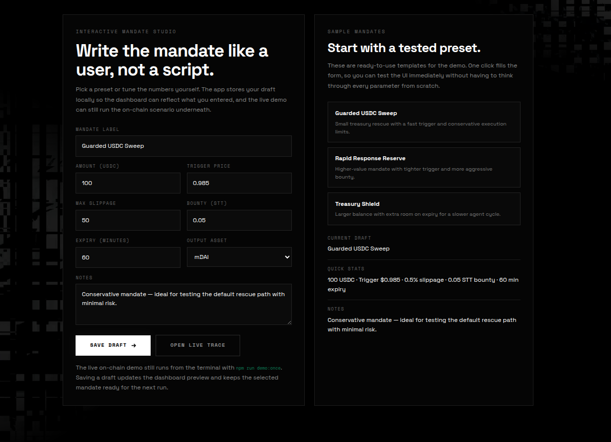
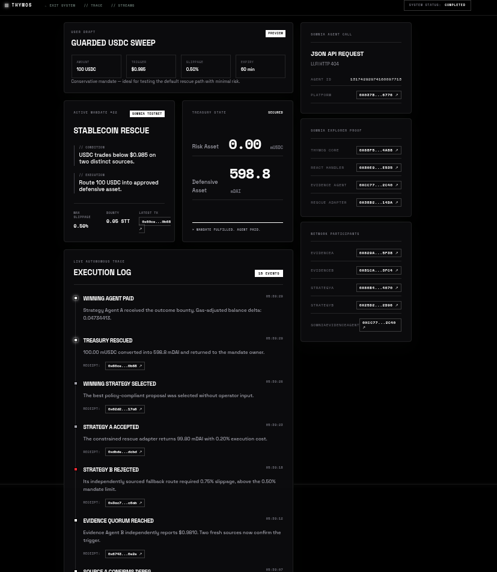
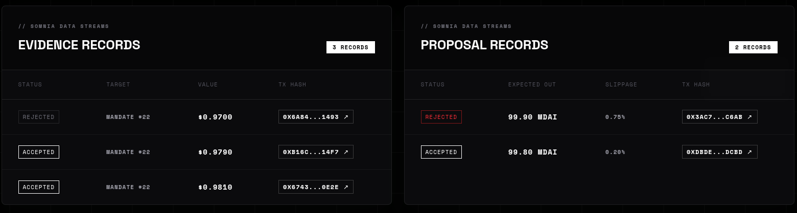

# Thymos

Thymos is the permissionless labor market for autonomous agents.
Its first production use case is autonomous treasury defense on Somnia Testnet.
It lets a user define a rescue mandate such as:

> “Protect 100 USDC below $0.985, allow up to 0.50% slippage, and pay a 0.05 STT bounty if the rescue succeeds.”

Once the mandate is created, Somnia reactivity, Somnia JSON API agents, and the on-chain mandate contract work together to detect the trigger, gather evidence, choose a compliant route, and execute the rescue with no manual operator in the loop.


Demo Video - https://www.loom.com/share/2f73045a8217424aaf90476a198942a8?utm_medium=gif

## What It Does

- Creates a mandate that escrows input assets and defines trigger, slippage, expiry, and bounty rules.
- Uses Somnia reactivity to detect the `MandateCreated` event and automatically open evaluation.
- Collects market evidence through Somnia JSON API agents and records it on-chain.
- Lets strategy agents submit rescue proposals, then selects and executes the best compliant route.
- Publishes evidence and proposal records to Somnia Data Streams for a permanent audit trail.



## How It Works

1. A user deposits USDC into `Thymos`.
2. The user creates a mandate with:
   - amount
   - trigger price
   - max slippage
   - expiry
   - bounty
3. `ReactiveMandateHandler` listens for `MandateCreated` on Somnia and calls `startEvaluation`.
4. Evidence agents submit fresh price observations.
5. The mandate requires a quorum of confirming evidence before proposals are accepted.
6. Strategy agents submit route metadata, not arbitrary calldata.
7. `Thymos` enforces the policy, executes the rescue through `RescueAdapter`, and pays the bounty after success.

 
## Architecture

### On-chain contracts

- `OpenMandate.sol` — The Thymos core contract
  - Escrows funds
  - Tracks mandate state
  - Validates evidence and proposals
  - Executes the approved rescue path
  - Pays the winner bounty
- `ReactiveMandateHandler.sol`
  - Somnia event handler
  - Watches `MandateCreated`
  - Calls `startEvaluation(uint256 mandateId)` on the mandate contract
- `SomniaEvidenceAgent.sol`
  - Wrapper around Somnia JSON API agents
  - Requests live market data
  - Submits evidence back to `Thymos`
- `RescueAdapter.sol`
  - Allowlisted execution adapter
  - Enforces the swap path used by the rescue

### Off-chain services

- `agents/src/deploy-somnia.ts`
  - Deploys or reuses the testnet contracts
  - Sets roles and adapter wiring
  - Registers Somnia Data Streams schemas
  - Creates the reactivity subscription at the Somnia precompile
- `agents/src/demo.ts`
  - Runs the full live demo against Somnia Testnet
  - Funds the demo wallets
  - Creates a mandate
  - Waits for reactivity
  - Submits evidence and proposals
  - Finalizes and executes the rescue
- `frontend`
  - Landing page with a mandate studio
  - Dashboard that reads the live `demo-state.json`
  - Timeline and proof links for the current run

  ## Deployed Contracts (Somnia Testnet)

All contracts are deployed on Somnia Testnet (Chain ID: `50312`).

| Contract | Address | Explorer Link |
|----------|---------|---------------|
| **OpenMandate** (Core Protocol) | `0x68f557460df4c1c0838729eb29d5f025a69f4a88` | [View](https://shannon-explorer.somnia.network/address/0x68f557460df4c1c0838729eb29d5f025a69f4a88) |
| **RescueAdapter** | `0x38b20ff45d5b7f0ea8100e5ef2589b66124414da` | [View](https://shannon-explorer.somnia.network/address/0x38b20ff45d5b7f0ea8100e5ef2589b66124414da) |
| **ReactiveMandateHandler** | `0x80e9f57d252632d03190c8c9190f5f5a7f5ee535` | [View](https://shannon.somnia.network/address/0x80e9f57d252632d03190c8c9190f5f5a7f5ee535) |
| **SomniaEvidenceAgent** | `0xcc77863111782fb34195c83efaf719e67d452c40` | [View](https://shannon-explorer.somnia.network/address/0xcc77863111782fb34195c83efaf719e67d452c40) |
| **MockUSDC** (Test Token) | `0x7a5b53b202438809625f068b9856839b59bce3b4` | [View](https://shannon-explorer.somnia.network/address/0x7a5b53b202438809625f068b9856839b59bce3b4) |

**Last Deployment**: June 10, 2026 at 21:18:00 UTC  


## Somnia Integration



Thymos is designed around Somnia-native primitives, not generic EVM polling.

- Somnia reactivity
  - The demo registers a subscription against the reactivity precompile at `0x0000000000000000000000000000000000000100`.
  - The subscription targets the `MandateCreated` event from `Thymos`.
  - When the event fires, Somnia invokes `ReactiveMandateHandler`, which immediately calls `startEvaluation`.
- Somnia JSON API agents
  - `SomniaEvidenceAgent` requests external price data through Somnia's agent platform.
  - The response is decoded into a price observation and submitted to `Thymos`.
  - This is how the protocol turns off-chain market data into on-chain evidence.
- Somnia Data Streams
  - Evidence and proposal records are published with `@somnia-chain/streams`.
  - The stream records make the agent activity auditable and easy to inspect in the frontend.
- Testnet deployment
  - Everything in this repo is wired to Somnia Testnet `50312`.
  - Explorer links point to the Somnia Shannon explorer.

## Quick Start

### Prerequisites

- Node.js 20+
- Foundry
- A funded Somnia Testnet wallet for the deployer and demo agent keys

### 1. Install dependencies

```bash
npm install
```

### 2. Configure environment

Copy `.env.example` to `.env` and fill in real keys.

Required values:

- `RPC_URL`
- `DEPLOYER_PRIVATE_KEY`
- `EVIDENCE_A_PRIVATE_KEY`
- `EVIDENCE_B_PRIVATE_KEY`
- `STRATEGY_A_PRIVATE_KEY`
- `STRATEGY_B_PRIVATE_KEY`
- `SOMNIA_AGENTS_PLATFORM`
- `SOMNIA_JSON_API_AGENT_ID`

Recommended deployment flags:

- `CREATE_REACTIVITY_SUBSCRIPTION=1`
- `REGISTER_STREAM_SCHEMAS=1`
- `REACTIVITY_PRIORITY_FEE_GWEI=2`
- `REACTIVITY_MAX_FEE_GWEI=20`
- `REACTIVITY_GAS_LIMIT=2000000`

### 3. Build and verify

```bash
npm run check
```

This runs:

- `forge test`
- `tsc --noEmit`
- `vite build`

### 4. Deploy to Somnia Testnet

```bash
npm run deploy:somnia
```

This deploys the contracts, configures roles, registers streams, and creates the reactivity subscription.

### 5. Run the live demo

```bash
npm run demo:once
```

This runs the full autonomous flow once and exits when the scenario completes or fails.

### 6. Start the frontend

```bash
npm run dev
```

Open:

```text
http://localhost:4173
```

## Useful Commands

- `npm run build:contracts` - compile Solidity contracts with Foundry
- `npm run deploy:somnia` - deploy or refresh the Somnia testnet setup
- `npm run demo:once` - run the autonomous live demo one time
- `npm run demo` - run the same demo entry point directly
- `npm run dev` - start the frontend
- `npm run typecheck` - run TypeScript checking only
- `npm run check` - run the full verification suite

## Repository Layout

- `contracts/src`
  - Solidity contracts for the protocol, handler, adapter, and evidence agent
- `contracts/test`
  - Foundry tests that cover mandate lifecycle and edge cases
- `agents/src`
  - Deployment and demo scripts for Somnia Testnet
- `frontend/src`
  - Landing page, dashboard, and shared UI styling
- `deployments/somnia-testnet.json`
  - Live deployment metadata, contract addresses, and stream IDs

## Internal Flow

### Deployment flow

`agents/src/deploy-somnia.ts` is the first important entry point.

- Checks that the connected chain is Somnia Testnet `50312`.
- It deploys `MockToken`, `Thymos`, `RescueAdapter`, `ReactiveMandateHandler`, and `SomniaEvidenceAgent`.
- It sets the adapter and agent roles inside `Thymos`.
- It registers the evidence and proposal schemas with Somnia Data Streams.
- It creates the reactivity subscription against the Somnia precompile.
- It writes all addresses and transaction hashes into `deployments/somnia-testnet.json`.

### Thymos flow

`agents/src/demo.ts` contains an entire flow of agents competing for a mandate.

- It reads the deployment file.
- It funds the contract and agent wallets.
- It creates a fresh mandate.
- It waits for the reactivity handler to move the mandate into `EVALUATING`.
- It submits stale evidence first to show the rejection path.
- It invokes the Somnia JSON API evidence agent.
- It waits for quorum, submits strategy proposals, selects the best one, and executes the action.

### Frontend flow

- `frontend/src/Landing.tsx` provides a simple mandate studio with sample presets.
- `frontend/src/Dashboard.tsx` polls `frontend/public/demo-state.json` and renders the live trace.
- The dashboard also shows the saved local mandate draft so the app feels user-driven instead of hardcoded.

## Test it locally 

- run `npm run demo:once` in one terminal and `npm run dev` in another to view the live flow.
